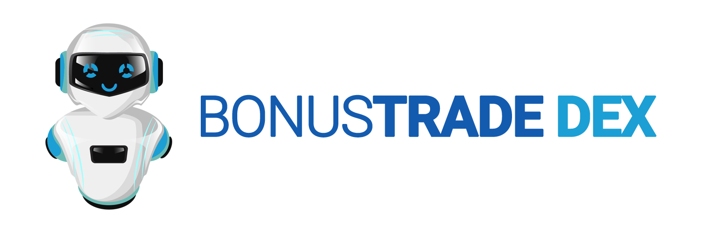

<!-- BANNER -->

<!-- TABLE OF CONTENT -->
# Table of Contents
<ol>
    <li>
      <a href="#introduction">Introduction</a>
      <ul>
        <li><a href="#bonustrade-dex-advantages">BonusTrade DEX Advantages</a></li>
      </ul>
    </li>
    <li>
      <a href="#getting-started">Getting Started</a>
      <ul>
        <li><a href="#installation">Installation</a></li>
        <li><a href="#bot-requirements">Bot Requirements</a></li>
        <li><a href="#bot-configuration">Bot Configuration</a></li>
        <li><a href="#how-the-bot-works">How the bot works</a></li>
        <li><a href="#do-we-need-to-change-the-default-node">Do we need to change the default node</a></li>
        <li><a href="#is-my-private-key-safe">Is my private key safe</a></li>
        <li><a href="#can-i-run-multiple-instances-of-the-bot-on-my-computer">Can I run multiple instances of the bot on my computer</a></li>
      </ul>
    </li>
  </ol>

<!-- INTRODUCTION -->

# Introduction

BonusTrade DEX is a decentralized finance (DeFi) trading bot for Uniswap and PancakeSwap.

<!-- DEX ADVANTAGES -->

## BonusTrade DEX Advantages

- Supports Windows, Mac OS, and Linux.
- Smart and intuitive UI – no confusing text files to configure!
- Written in Typescript/JavaScript and Node.js with asynchronous functions that result in extremely fast execution*
- Connects directly into the Ethereum and BSC blockchain node.
- Encrypted data and private key.
- Place limit orders.
- Multi wallet support. You can trade different tokens simultaneously, either with a single wallet or across multiple wallets.
- Auto-update feature. No need to re-download and setup everything from scratch for each new update.
- Supports Uniswap (V2) and PancakeSwap (V2).
- More exchanges coming soon!

<!-- GETTING STARTED -->

# Getting Started

<!-- INSTALLATION -->

## Installation

- Download the bot from our GitHub [release page](https://github.com/bonustrade/dex/releases/).
- Select the bot based on your operating system.
- Just install the bot and you’re done!

<!-- BOT REQUIREMENTS -->

## Bot Requirements

You need to sign up and be securely logged in to use the app. You can select sign up/login with Google or Facebook or use your email. Once logged in, you can start using the app.

<!-- BOT CONFIGURATION -->

## Bot Configuration

- **Exchanges field**. List of available exchanges.
- **Set Custom Node** button. A method to change the default Node URL.
- **Gas Price** field. You can set the gas price based of your preferences. For Ethereum network (Uniswap) refer to [current gas price](https://etherscan.io/gastracker). For BSC Network (PancakeSwap) 5 GWEI is the minimum gas price, you can set as much as you prefer.
- **Gas Limit** field. You can set the gas limit for each buy & sell transaction based on your preferences. The default gas limit is 178198 and you can leave it as it is.
- **Add New Wallet** button. You can add a wallet using a private key or a JSON Keystore wallet with password. Your private key is encrypted and saved locally on the app. The wallet can be used later for each token pair.
- **Wrap ETH/BNB to WETH/WBNB** button. A function to wrap/convert from ETH/BNB to WETH/WBNB.
- **Wrap WETH/WBNB to ETH/BNB** button. A function to wrap/convert from ETH/BNB to WETH/WBNB.
- **Add New Token**. To add new token, you need the Contract Address of the token. You can also select the wallet for each token list.
- **Check Tokens Approval**. A function to check the tokens approval with the exchange router contract address.

<!-- HOE THRE BOT WORKS? -->

## How the bot works

The BonusTrade DEX bot will check token prices every five seconds. If the price is within the range of Buy At value, then the bot will execute the buy order. The bot will use all available WETH/WBNB balance in the wallet that’s associated with the token list to buy the token. It is recommended, although not necessary, to use a different wallet for each token being traded. After a successful token buy, the bot will keep checking the sell price range. It will sell all of the token amount from the wallet once the defined sell price threshold is reached. If the token price is equal to or below the stop-loss value, it will sell all of your token back to WETH/WBNB.

<!-- DO WE CHANGE -->

## Do we need to change the default node?

It depends. We are providing the default public node for you to use. But there is always a chance that this public node will be down/not accessible for a period of time or be experiencing adverse performance issues e.g. due to an excessive volume of users at any given time. For this reason, you may choose to take advantage of the node services of a third party (usually paid plans), such as Infura or QuickNode. Alternatively, you can use any available other public node. You can get the BSC public node [here](https://docs.binance.org/smart-chain/developer/rpc.html) here and Ethereum node from [Cloudflare](https://developers.cloudflare.com/distributed-web/ethereum-gateway/getting-started).

<!-- IS KEY SAFE! -->

## Is my private key safe?

Yes of course. Your private key is encrypted on the app and we never have access to the private key. This is how to [export your private key](https://metamask.zendesk.com/hc/en-us/articles/360015289632-How-to-Export-an-Account-Private-Key).

<!-- MULTIPLE INSTANCE -->

## Can I run multiple instances of the bot on my computer?

Yes, you can! All you need to do is launch additional instances of the app and it will display as a new window. This is helpful if you want to trade multiple DEXs at the same time i.e. Uniswap and PancakeSwap (additional DEXs to be added soon!).
